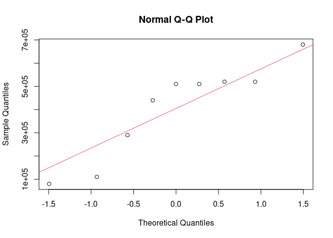
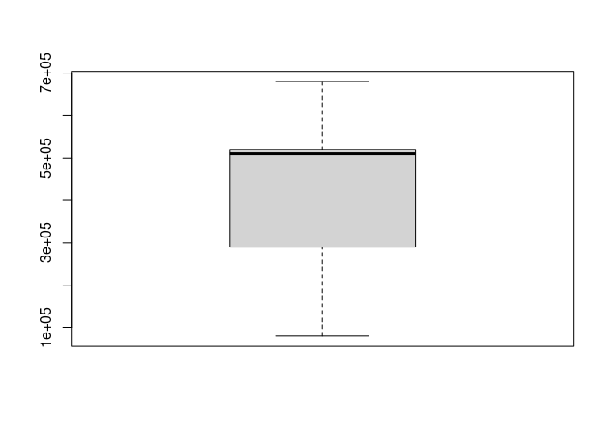
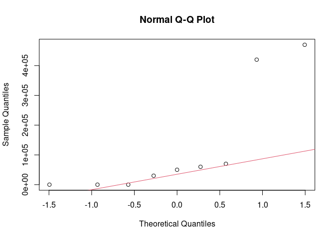
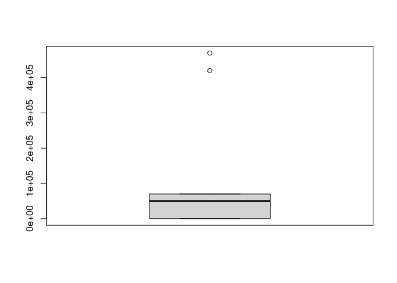
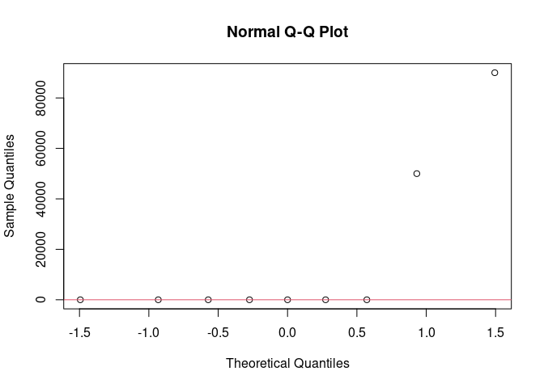
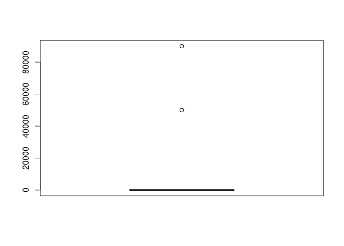

PREP R Workshop
================
Zachary Brehm and David Burton

## Introduction to R

R is the most frequently used computing language in statistics. It is
flexible and open source, so you can accomplish quite a lot with it
without having to pay for expensive software. RStudio is essentially the
notebook that we will use to write code in. There are four panels that
make up the window of the editor.

-   Source: A persistent file that we will do most of our work in, this
    is the panel that you may currently be reading this document in.
    Here, we can type and edit code and create new files.

-   Console: This is the window that our code gets passed to when we
    want to run it. The source file is where we think about what we want
    to say, and the console is where we actually talk to the computer
    through R.

-   Environment: Throughout our coding, we will create different objects
    that we want to keep using over and over. These objects get saved
    into memory, and the environment panel is where we can see what we
    have saved for use.

-   File Browser: This panel allows us to navigate through the directory
    on our computer. It also contains panels that let us view plots and
    look through help files for the functions that we will use, and
    browse through different R packages.

Packages are sort of like new toolboxes that add new functions to R. R
itself contains many useful tools that allow us to work with data and
carry out analyses, but one of the best things about R is that we can
develop our own tools to expand on Rs capabilities and put them out into
the wild for others to use.

Let’s install a new package so we can see how it’s done.

``` r
install.packages(pkgs = "tidyverse")
library(tidyverse)

new_pkgs <- c("plyr", "reshape2", "sm", "wesanderson")
install.packages(pkgs = new_pkgs)
```

Most work that we do in R is performed by running *functions* on
*objects*.

The simplest way to make an object in R is to just assign a numerical
value to a variable. This done by typing in an arrow that points the
value towards the variable name.

``` r
n_points <- 10
our_mean <- 7
our_sd <- 1
x <- rnorm(n = n_points, mean = our_mean, sd = our_sd)
print(x)
```

    ##  [1] 7.865063 6.810845 7.193109 7.271258 7.625713 7.712146 5.768673 8.021459
    ##  [9] 5.190325 6.694706

``` r
mean(x)
```

    ## [1] 7.01533

``` r
sd(x)
```

    ## [1] 0.9261018

R objects are grouped into classes which represent specific things. The
main classes that we use are

-   Numerics: Any numbers, also includes infinity and NaN for “not a
    number” (like 0/0 or Inf/Inf)

-   Integers

-   Characters: The class for words, essentially.

-   Logicals: TRUE or FALSE values, also includes NA values for missing
    data

-   Factors: Factors are unique in that they have an ordering to them.
    They are useful when you have categorical variables. Usually we use
    them as a way to add an ordering structure to character vectors, but
    they can be used for numbers as well. In fact, R considers factors
    to be integers under the hood and just displays their names when we
    work with them.

``` r
x <- 7
class(x)
```

    ## [1] "numeric"

``` r
x <- 7L
class(x)
```

    ## [1] "integer"

``` r
x <- "Seven"
class(x)
```

    ## [1] "character"

``` r
x <- "7"
class(x)
```

    ## [1] "character"

``` r
x <- 5+2i
class(x)
```

    ## [1] "complex"

``` r
x <- TRUE
class(x)
```

    ## [1] "logical"

``` r
x <- 5/0
x
```

    ## [1] Inf

``` r
class(x)
```

    ## [1] "numeric"

``` r
x <- 0/0
x
```

    ## [1] NaN

``` r
class(x)
```

    ## [1] "numeric"

``` r
x <- factor(c("up","down","up","down","down"))
x
```

    ## [1] up   down up   down down
    ## Levels: down up

``` r
x <- factor(c("up","down","up","down","down"), levels=c("up","down"))
x
```

    ## [1] up   down up   down down
    ## Levels: up down

``` r
as.integer(x)
```

    ## [1] 1 2 1 2 2

``` r
unclass(x)
```

    ## [1] 1 2 1 2 2
    ## attr(,"levels")
    ## [1] "up"   "down"

``` r
table(x)
```

    ## x
    ##   up down 
    ##    2    3

We can collect many different values into the same object as well. Some
of the most common ways that we organize our data are

-   Vectors: Vectors are one dimensional objects in R. They are columns
    that contain values in each entry position. You can kind of think of
    them like skinny cabinets with shelves. You can put one value onto
    each of the shelves.

-   Matrices: Matrices are just a bunch of vectors bound together, so
    it’s like you took a bunch of cabinets and pushed them together.
    Something to keep in mind when creating matrices is that all of the
    vectors that combine into a matrix must be of equal length,
    otherwise you will have NA values filling in the gaps.

-   Lists: Lists are kind of like matrices in that they are collections
    of many vectors put together. However, lists are convenient because
    they don’t need to contain all of the same classes of vectors, nor
    do the vectors need to be of the same length.

-   Dataframes: Data frames are an extension of matrices to allow for
    variables of different classes. Data frames require that each
    variable be of the same length, like a matrix, but there is no
    requirement that variables all be numbers or characters, like a
    list.

``` r
x <- c(5, 7, 13)
x
```

    ## [1]  5  7 13

``` r
class(x)
```

    ## [1] "numeric"

``` r
y <- c("five", "seven", "thirteen")
y
```

    ## [1] "five"     "seven"    "thirteen"

``` r
class(y)
```

    ## [1] "character"

``` r
l <- matrix(data = c(4, 8, 15, 16, 23, 42), nrow = 3, ncol = 2, byrow = TRUE)
l
```

    ##      [,1] [,2]
    ## [1,]    4    8
    ## [2,]   15   16
    ## [3,]   23   42

``` r
rbind(1:3, 4:6)
```

    ##      [,1] [,2] [,3]
    ## [1,]    1    2    3
    ## [2,]    4    5    6

``` r
cbind(1:3, 4:6)
```

    ##      [,1] [,2]
    ## [1,]    1    4
    ## [2,]    2    5
    ## [3,]    3    6

``` r
line_one <- c("Yeah", "I'm", "gonna", "take", "my", "horse", "to", "the", "old", "town", "road")
line_two <- c("I'm", "gonna", "ride", "'til", "I", "can't", "no", "more")
old_town_road <- list(line_one, line_two)
old_town_road
```

    ## [[1]]
    ##  [1] "Yeah"  "I'm"   "gonna" "take"  "my"    "horse" "to"    "the"   "old"  
    ## [10] "town"  "road" 
    ## 
    ## [[2]]
    ## [1] "I'm"   "gonna" "ride"  "'til"  "I"     "can't" "no"    "more"

``` r
library(gapminder)
View(head(gapminder))
```

If we try to combine objects of different types into vectors or matrices
then R will automatically convert them into the same class. It’s usually
safer to just make sure that you convert everything into the same class
before you combine objects together.

``` r
## mixed types; implicit coercion
z <- c(x, y)
class(z)
```

    ## [1] "character"

``` r
m <- matrix(data = z, nrow = 3, ncol = 2, byrow = FALSE)
str(m)
```

    ##  chr [1:3, 1:2] "5" "7" "13" "five" "seven" "thirteen"

``` r
## explicit coercion
x <- 1
class(x)
```

    ## [1] "numeric"

``` r
x <- integer(x)
class(x)
```

    ## [1] "integer"

``` r
as.logical(x)
```

    ## [1] FALSE

Sometimes we will want to just look at a small part of our data, and we
can do this by subsetting the overall data.

-   Vectors: To subset a vector, just type the name of the vector and
    follow it with a set of brackets that contain the numbers of the
    entries that we’d like to see.

-   Matrices: Since matrices are two dimensional, whereas vectors are
    one dimensional, we need to provide the subsetting operation with
    both the rows and columns that we would like to look at. The first
    position of the subset always refers to rows, and the second always
    refers to columns.

-   Lists: Subsetting lists is a bit different. First, we need to
    specify the lines that we would like to look at which double
    brackets and then specify the entries of the line that we could like
    to look at with single brackets, like x\[\[1\]\]\[1\].

-   Dataframes: The nice thing about dataframes is that the variables
    all have names, so we can just tell R the names that we could like
    to look at by typing the name of the dataframe and following that
    with a dollar sign and the name of the variable, like x$y.

``` r
x[2]
```

    ## [1] NA

``` r
x[c(1,3)]
```

    ## [1]  0 NA

``` r
x[-2]
```

    ## [1] 0

``` r
m[1, 2]
```

    ## [1] "five"

``` r
m[c(1, 3), ]
```

    ##      [,1] [,2]      
    ## [1,] "5"  "five"    
    ## [2,] "13" "thirteen"

``` r
m[ , -1]
```

    ## [1] "five"     "seven"    "thirteen"

``` r
old_town_road[[1]]
```

    ##  [1] "Yeah"  "I'm"   "gonna" "take"  "my"    "horse" "to"    "the"   "old"  
    ## [10] "town"  "road"

``` r
old_town_road[[2]][1:3]
```

    ## [1] "I'm"   "gonna" "ride"

``` r
head(gapminder$lifeExp)
```

    ## [1] 28.801 30.332 31.997 34.020 36.088 38.438

``` r
gapminder$lifeExp[gapminder$country == "El Salvador"]
```

    ##  [1] 45.262 48.570 52.307 55.855 58.207 56.696 56.604 63.154 66.798 69.535
    ## [11] 70.734 71.878

``` r
rm(list = objects())
```

We don’t always have to create our data by hand, it is usually easier to
just read an existing file into R.

``` r
## read in data
msleep <- read.table("data/msleep.csv", sep=",", header=TRUE)
msleep$name <- as.character(msleep$name)
```

We are now ready to find some simple statistics in our data. The next
code chunk will calculate several simple summary statistics on our
variables. We can also see how to add comments to our code with the
hashtag symbol followed by text. The hashtag symbol tells R to not
evaluate the line, so we can use comments to remind ourselves what we
are doing. We should always try to comment our code because it can be
difficult to remember what we were doing if we ever revisit it in the
future.

``` r
## simple summary statistics
## mean: the average value of a variable
mean(msleep$sleep_total)
```

    ## [1] 10.43373

``` r
mean(msleep$sleep_rem, na.rm = TRUE)
```

    ## [1] 1.87541

``` r
## median: the midpoint of a variable, half of the data is less
## than this value and the other half of the data is greater than this value
median(msleep$sleep_rem)
```

    ## [1] NA

``` r
## since sleep_rem has missing data, we have a median of NA
## there are a couple of ways we can get around this and just look
## at the median of the data that we actually know
median(msleep$sleep_rem, na.rm=TRUE)
```

    ## [1] 1.5

``` r
median(msleep$sleep_rem[!is.na(msleep$sleep_rem)])
```

    ## [1] 1.5

``` r
## range: range shows us the minimum and maximum value of our data
range(msleep$sleep_total)
```

    ## [1]  1.9 19.9

``` r
## inner quartile range: sometimes we don't care about outlier samples, so 
## the IQR tells use the range from the 25th to 75th percentile
IQR(msleep$sleep_total)
```

    ## [1] 5.9

``` r
## stratifying using the by function
## by: this function lets us stratify our data so that we can calculate
## statistics for different subsets of data quickly, here we
## calculate the mean value of total sleep by each diet type
means <- by(msleep$sleep_total, msleep$vore, mean)
```

## Read in the data

## One Sample T-test

### Test Assumptions

#### Continuous Variable

Theoretically our data could take any value from 0 to some unknown
maximum. This qualifies as continuous for these purposes.

#### Independent Data

We are assuming this one. Our data are individual trials of treatments
on samples from a population, and so this feels pretty safe.

#### Normality

``` r
qqnorm(control)
qqline(control,col=2)
```

<!-- -->

``` r
shapiro.test(control)
```

    ## 
    ##  Shapiro-Wilk normality test
    ## 
    ## data:  control
    ## W = 0.87519, p-value = 0.1397

Our qqplot was pretty reasonable, and the Shapiro Wilk test rejected the
null. In the Shapiro-Wilk test the null hypothesis is that the data is
normally distributed

#### Outliers in the Data

``` r
boxplot(control)
```

<!-- -->

This is a quick visual check to see if we have outliers, and we don’t.
We don’t have any data points outside the min and max lines.

#### The Test

``` r
t.test(control,alternative = "greater", mu = 450000)
```

    ## 
    ##  One Sample t-test
    ## 
    ## data:  control
    ## t = -0.63892, df = 8, p-value = 0.7296
    ## alternative hypothesis: true mean is greater than 450000
    ## 95 percent confidence interval:
    ##  280546    Inf
    ## sample estimates:
    ## mean of x 
    ##  406666.7

Fail to reject the null, and we conclude that the mean of our control
group is not significantly greater than 450,000.

Suppose we had missing data though. What if it were our smallest values
that were missing, and we did the test anyway?

``` r
t.test(control[which(control>400000)],alternative = "greater", mu = 450000)
```

    ## 
    ##  One Sample t-test
    ## 
    ## data:  control[which(control > 4e+05)]
    ## t = 2.4649, df = 5, p-value = 0.02844
    ## alternative hypothesis: true mean is greater than 450000
    ## 95 percent confidence interval:
    ##  464601.4      Inf
    ## sample estimates:
    ## mean of x 
    ##    530000

### If Assumptions Aren’t Met

Statisticians have invented non-parametric tests for when things like
normality assumptions aren’t met. The Wilcoxon Ranked Signed Test is the
non-parametric alternative to the one sample t-test. It can be used when
the data is not normally distributed. It compares the median instead of
the mean.

``` r
wilcox.test(control,alternative = "greater",mu = 450000)
```

    ## Warning in wilcox.test.default(control, alternative = "greater", mu = 450000):
    ## cannot compute exact p-value with ties

    ## 
    ##  Wilcoxon signed rank test with continuity correction
    ## 
    ## data:  control
    ## V = 21, p-value = 0.5938
    ## alternative hypothesis: true location is greater than 450000

The Wilcoxon test is not completely computable when there are ties.
However, you should see agreement between both test when your data is
normally distributed, as ours was according to the Shapiro-Wilk test.

## 2 Sample T-test

### Test Assumptions

#### Continuous Variable

Theoretically our data could take any value from 0 to some unknown
maximum. This qualifies as continuous for these purposes just as in the
first test.

#### Independent Data

We are assuming this one. Our data are individual trials of treatments
on samples from a population, and so this feels pretty safe. Now that we
have two groups not much has changed; they both just endured different
treatments. This makes it easy to assume they are independent of one
another.

#### Normality

We already know that the control group was normal enough for a t-test,
but what about the one percent dosage group?

``` r
qqnorm(oneDMSO)
qqline(oneDMSO,col=2)
```

<!-- -->

This plot looks much worse!

``` r
shapiro.test(oneDMSO)
```

    ## 
    ##  Shapiro-Wilk normality test
    ## 
    ## data:  oneDMSO
    ## W = 0.6717, p-value = 0.0006626

Our Shapiro-Wilk test rejected the null!! P &lt; .05! We do not have
normality! IRL we would now only consider a non-parametric test.

For the sake of education, I will still show you the parametric code,
but bear in mind that it would be tough, and very inadvisable, to
justify this parametric test now.

#### Equal Variance

In a 2 sample t-test we assume equal variance.

``` r
var.test(x = control, y = oneDMSO, alternative = "two.sided")
```

    ## 
    ##  F test to compare two variances
    ## 
    ## data:  control and oneDMSO
    ## F = 1.2054, num df = 8, denom df = 8, p-value = 0.798
    ## alternative hypothesis: true ratio of variances is not equal to 1
    ## 95 percent confidence interval:
    ##  0.2719072 5.3440072
    ## sample estimates:
    ## ratio of variances 
    ##           1.205435

We have good news here. Our variances are not significantly different,
and the ratio of them is fairly close to 1. We can proceed with the
assumption that the two groups have equal variance.

#### Outliers in the Data

``` r
boxplot(oneDMSO)
```

<!-- -->

Our boxplot confirms what we suspected from our normality checks. The
two lone dots way up at the top indicate that we have outliers. These
outliers are also probably responsible for our lack of normality.

Remember the missing data example though, we don’t want to just throw
these observations our, or we could risk coming to a wrong conclusion
when we test.

#### The Test

``` r
t.test(x = control,y = oneDMSO,alternative = "greater",var.equal = T)
```

    ## 
    ##  Two Sample t-test
    ## 
    ## data:  control and oneDMSO
    ## t = 3.1006, df = 16, p-value = 0.003436
    ## alternative hypothesis: true difference in means is greater than 0
    ## 95 percent confidence interval:
    ##  124278.8      Inf
    ## sample estimates:
    ## mean of x mean of y 
    ##  406666.7  122222.2

We reject the null, and we conclude that the difference of the means of
our gropus is significantly greater than 0.

In other words we have a statistical test to confirm, or support, the
conclusiong that the groups have different means.

Suppose we had specified a different alternative, such as the default
two sided.

``` r
t.test(x = control,y = oneDMSO,alternative = "two.sided",var.equal = T)
```

    ## 
    ##  Two Sample t-test
    ## 
    ## data:  control and oneDMSO
    ## t = 3.1006, df = 16, p-value = 0.006871
    ## alternative hypothesis: true difference in means is not equal to 0
    ## 95 percent confidence interval:
    ##   89966.39 478922.50
    ## sample estimates:
    ## mean of x mean of y 
    ##  406666.7  122222.2

We still reject the null hypothesis, but this time we don’t declare for
gtreater or less. we can only conclude that the true difference is not
equal to 0, or in more plain english, they aren’t equal.

### If Assumptions Aren’t Met

The non-parametric test for this situation, which if you recall is the
one we should be using, is the Wilcoxon Rank Sum or Mann-Whitney test
depending on who you ask.

``` r
wilcox.test(control,y = oneDMSO,alternative = "greater")
```

    ## Warning in wilcox.test.default(control, y = oneDMSO, alternative = "greater"):
    ## cannot compute exact p-value with ties

    ## 
    ##  Wilcoxon rank sum test with continuity correction
    ## 
    ## data:  control and oneDMSO
    ## W = 74, p-value = 0.001733
    ## alternative hypothesis: true location shift is greater than 0

The Wilcoxon test is still unhappy about our ties in the data. However,
we still see agreement between both tests. The p-value is below .05. We
reject the null hypothesis, and we can conclude that the true difference
between the central tendency of the groups is greater than 0.

## ANOVA: Analysis of Variance

For when you have more than two groups to compare. ANOVA assumptions are
also a bit differently focused than t-test assumptions in their
mathematical underpinnings, but they are relatively the same as far as
practically checking them in R.

### Test Assumptions

#### Continuous Variable

We’re still safely in the continuous variable ball park here.

#### Independent Data

IT is very important for ANOVA that we have independent groups we are
testing. Luckily this is the simplest most straight forward assumption
for us, and we have no doubt that this design of three groups from the
same population receiving different treatments fits the independence
assumption.

#### Normality

In ANOVA we are concerned that the residuals are normally distributed,
but we can check that by checking each groups normality of the raw dat
separately. We already know the control is normal and the one percent
dose is not.

``` r
qqnorm(tenDMSO)
qqline(tenDMSO,col=2)
```

<!-- -->

I think we can safely tell we have a problem here just by visual
inspection.

``` r
shapiro.test(tenDMSO)
```

    ## 
    ##  Shapiro-Wilk normality test
    ## 
    ## data:  tenDMSO
    ## W = 0.56848, p-value = 4.08e-05

We get an extremely low, practically 0 p value! Keep in mind, you can’t
do this ANOVA in this situation in real life. We’re only going to do it
here for illustrative purposes. WE need to rely only on the
non-parametric test for our conclusions, not the ANOVA.

#### Outliers in the Data

``` r
boxplot(tenDMSO)
```

<!-- -->

ANOVA test aren’t sensitive to outliers in the data quite the same way
t-tests are, but just for completeness, here’s the ten percent treatment
group box plot anyway.

It’s clear to see that this would be a bad situation for the t-test in
both the outliers and the normality.

#### Equal Variances

ANOVA is concerned with equal variances. We can test for equal variances
easier if the data is in one object.

``` r
cellData <- data.frame(control,oneDMSO,tenDMSO)
```

Again, there are a couple of options for this, the Bartlett’s test and
the Levene test. However, the Levene test is preferred for non-normal
data, and we know that we have some.

We’ll need our data format altered to do this most easily.

``` r
library(tidyverse)
```

    ## ── Attaching packages ─────────────────────────────────────── tidyverse 1.3.0 ──

    ## ✓ ggplot2 3.3.3     ✓ purrr   0.3.4
    ## ✓ tibble  3.0.6     ✓ dplyr   1.0.4
    ## ✓ tidyr   1.1.2     ✓ stringr 1.4.0
    ## ✓ readr   1.4.0     ✓ forcats 0.5.1

    ## ── Conflicts ────────────────────────────────────────── tidyverse_conflicts() ──
    ## x dplyr::filter() masks stats::filter()
    ## x dplyr::lag()    masks stats::lag()

``` r
cellDataRearranged <- cellData %>% gather(key = Group,value = cellCount)

library(car)
```

    ## Loading required package: carData

    ## 
    ## Attaching package: 'car'

    ## The following object is masked from 'package:dplyr':
    ## 
    ##     recode

    ## The following object is masked from 'package:purrr':
    ## 
    ##     some

``` r
leveneTest(cellCount~Group,data=cellDataRearranged)
```

    ## Warning in leveneTest.default(y = y, group = group, ...): group coerced to
    ## factor.

    ## Levene's Test for Homogeneity of Variance (center = median)
    ##       Df F value Pr(>F)
    ## group  2  2.1296 0.1408
    ##       24

Our Levene test has a p value greater than .05, so we fail to reject the
null hypothesis that the groups have equal variances.

#### The Test

One more reminder, we have failed assumptions, and this is not the
correct test.

``` r
aov.results <-  aov(formula = cellCount~Group,data = cellDataRearranged)
summary(aov.results)
```

    ##             Df    Sum Sq   Mean Sq F value   Pr(>F)    
    ## Group        2 7.358e+11 3.679e+11   14.37 7.88e-05 ***
    ## Residuals   24 6.144e+11 2.560e+10                     
    ## ---
    ## Signif. codes:  0 '***' 0.001 '**' 0.01 '*' 0.05 '.' 0.1 ' ' 1

We want to look at the probability of greater than “F” which is our
p-value here. It is much smaller than .05, and we reject the null
hypothesis that the groups are not different from one another.

That means we need to do one more test.

We want to know which groups are different from one another, and we can
use Tukey’s Honest Significant Differences test (no, I’m not making that
name up, nor does it imply the other tests are dishonest) to check each
pairwise comparison.

``` r
TukeyHSD(aov.results)
```

    ##   Tukey multiple comparisons of means
    ##     95% family-wise confidence level
    ## 
    ## Fit: aov(formula = cellCount ~ Group, data = cellDataRearranged)
    ## 
    ## $Group
    ##                      diff       lwr        upr     p adj
    ## oneDMSO-control -284444.4 -472798.2  -96090.66 0.0026005
    ## tenDMSO-control -391111.1 -579464.9 -202757.33 0.0000748
    ## tenDMSO-oneDMSO -106666.7 -295020.5   81687.12 0.3496531

Oh joy, more p-values.

The table clearly shows that only the treatment groups and the control
differ from one another significantly. We now have the result that the
two treatments do not differ significantly, but they each do from the
control. The small adjusted p-values tell us this, but we can also see
that the confidence intervals in the ouput do not contain 0.

However, our assumptions were not met. We needed a non-parametric test.

### If Assumptions Aren’t Met

The Kruskal-Wallis rank sum test is our option here.

``` r
kruskal.test(cellCount ~ Group,data = cellDataRearranged)
```

    ## 
    ##  Kruskal-Wallis rank sum test
    ## 
    ## data:  cellCount by Group
    ## Kruskal-Wallis chi-squared = 16.579, df = 2, p-value = 0.0002512

As expected, the Kruskal-Wallis test confirms that the null is to be
rejected and there is a significant difference between at least two of
the groups. We know this though, because we already have 2 sample t-test
results that tell us at least two of the groups are different, the one
percent dose and control.

When you see that there are differences in at least two of the groups,
you need to go further. Our friend Wilcoxon returns to help us, what a
dear.

``` r
pairwise.wilcox.test(x = cellDataRearranged$cellCount,g=cellDataRearranged$Group,p.adjust.method = "BH")
```

    ## Warning in wilcox.test.default(xi, xj, paired = paired, ...): cannot compute
    ## exact p-value with ties

    ## Warning in wilcox.test.default(xi, xj, paired = paired, ...): cannot compute
    ## exact p-value with ties

    ## Warning in wilcox.test.default(xi, xj, paired = paired, ...): cannot compute
    ## exact p-value with ties

    ## 
    ##  Pairwise comparisons using Wilcoxon rank sum test with continuity correction 
    ## 
    ## data:  cellDataRearranged$cellCount and cellDataRearranged$Group 
    ## 
    ##         control oneDMSO
    ## oneDMSO 0.0052  -      
    ## tenDMSO 0.0011  0.0808 
    ## 
    ## P value adjustment method: BH

Once again we force the Wilcoxon test to grapple with ties, but we get 3
p-values, just like with the Tukey HSD. In fact, the pairwise wilcoxon
agrees with the Tukey HSD; the two treatments do not have a p-value
below .05 and are not significantly different from one another. Both
treatment are separately significantly different from the control
though. The adjustment method of BH is the Benjamini-Hochberg multiple
testing adjustment. In pairwise tests, since you are testing for
multiple things at once, the math needs to change to accurately reflect
that. Specifying an adjustment method allows for the R functions to do
that. The Benjamini-Hochberg adjustment is a preferred choice in the
statistcal literature for these types of situations.

## Conclusion

This is a huge information dump in a short period of time, and it is
hardly a substitute for a few solid statistics courses either online or
in the classroom. There are lots of free online tutorials for all of
these topics, and I hope some of this sticks with you.

As always, please consider seeking the help of a statistician if you
ever encounter issues in your work. Keep in mind, if you’re in a
graduate program there may be other students in other graduate programs
at your university who would get value out of helping you in their area
of expertise. Even if you do outsource your statistics though, having a
basic grasp of how they work will make it easier for you to collaborate
with others in multidisciplinary teams.
